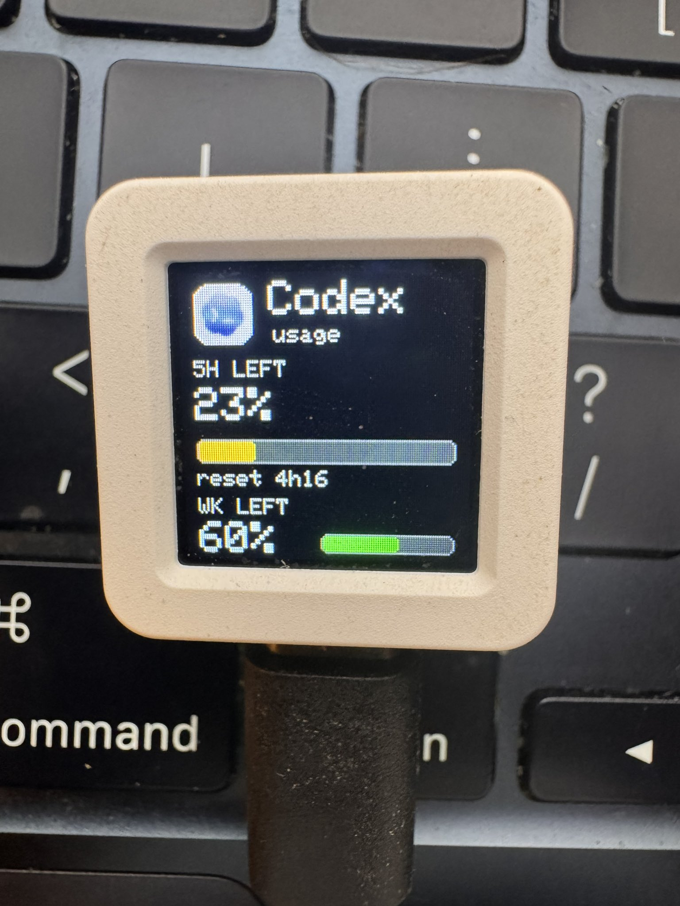
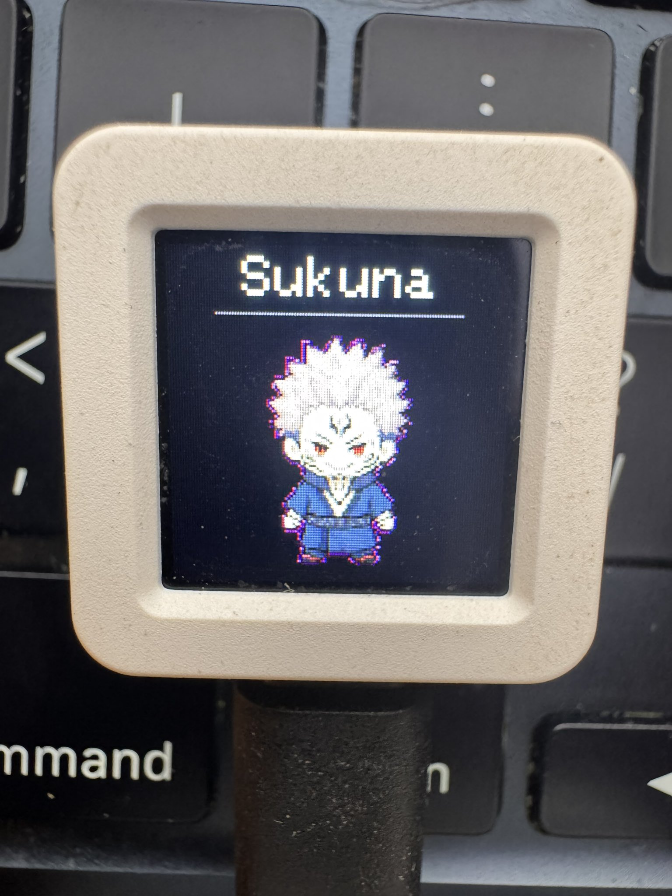

# CodexMeter

A tiny desk display for Codex usage on the M5Stack AtomS3 — plus an iOS app and widget so you can check your usage from your phone.

CodexMeter shows your current Codex rate-limit windows, connection status, a rotating status pet, and your active Codex session on a 128×128 screen the size of a postage stamp. It sits next to your keyboard and updates live while you work. The iOS app discovers the daemon on your local network and mirrors the same data on your iPhone.

> 📚 **[Wiki](https://github.com/BlockedPath/CodexMeter/wiki)** — full documentation · **[Project Board](https://github.com/users/BlockedPath/projects/3)** — roadmap & progress





---

## What You Need

### For the Full Setup (AtomS3 device + daemon)

**Hardware:**

- [M5Stack AtomS3](https://shop.m5stack.com/products/atom-s3) (~$15) — ESP32-S3 board with built-in 128×128 TFT display, button, and USB-C
- USB-C **data** cable (not charge-only — must support data transfer; the one in the box works)

**Software prerequisites:**

| Prerequisite | Minimum Version | Check |
|---|---|---|
| Python 3 | 3.10+ | `python3 --version` |
| git | any recent | `git --version` |
| PlatformIO CLI | 6.x | installed via pip below |
| macOS or Linux | — | Windows may work over serial but is untested |

**Codex account:**

- A [Codex](https://github.com/openai/codex) installation with an active session — the daemon reads `~/.codex/auth.json` for live OAuth usage data.
- Without a logged-in Codex session, the daemon falls back to counting local Codex activity. Optionally set `OPENAI_ADMIN_KEY` or `OPENAI_API_KEY` for OpenAI organization cost tracking as another fallback.

### For the iOS App / Widget Only

| Prerequisite | Minimum Version | Check |
|---|---|---|
| macOS | 15+ (for Xcode 16) | — |
| Xcode | 16.0+ | `xcodebuild -version` |
| XcodeGen | 2.x+ | `brew install xcodegen` |
| iOS device | iOS 17.0+ | required for Local Network / Bluetooth permissions |
| CodexMeter daemon | running on a Mac on the same LAN | see daemon setup below |

The iOS app discovers the daemon over Bonjour (mDNS), so the daemon must be running somewhere on your local network. You do **not** need an AtomS3 to use the iOS app — the app shows usage data fetched from the daemon, with or without a physical display.

---

## Quick Start — Full Setup

```bash
# 1. Clone
git clone https://github.com/BlockedPath/CodexMeter.git
cd CodexMeter

# 2. Create virtual environment and install everything
python3 -m venv .venv
.venv/bin/pip install platformio -r requirements.txt

# 3. Run the health check
bash doctor.sh

# 4. Connect your AtomS3 via USB-C, then find its port
.venv/bin/platformio device list
# Look for VID:PID=303A:1001 → e.g. /dev/cu.usbmodem101

# 5. Smoke-test your hardware (optional but recommended)
.venv/bin/platformio run -d firmware -e m5stack_atoms3_smoke -t upload --upload-port /dev/cu.usbmodem101
# Screen should cycle red → green → blue, then show "AtomS3 CodexMeter"

# 6. Flash the full firmware
.venv/bin/platformio run -d firmware -e m5stack_atoms3 -t upload --upload-port /dev/cu.usbmodem101
# Or use the helper:
bash flash.sh /dev/cu.usbmodem101 m5stack_atoms3
# Screen shows "waiting for host" on a dark background

# 7. Run the daemon
.venv/bin/python daemon/codex-usage-daemon.py --transport serial
# Or one-shot to test:
.venv/bin/python daemon/codex-usage-daemon.py --transport serial --once

# 8. (Optional) Install as a background service
bash install.sh
```

After step 7, the AtomS3 display should update from "waiting for host" to live usage data. Press the button to cycle through screens.

---

## Daemon Setup (Detailed)

The daemon is the data pipeline — it reads Codex usage and pushes it to your AtomS3 over USB serial, BLE, or both, while also serving an HTTP API for the iOS app.

### Install dependencies

```bash
python3 -m venv .venv
.venv/bin/pip install -r requirements.txt
```

This installs:

| Package | Purpose |
|---|---|
| `bleak` | BLE host (cross-platform) |
| `pyserial` | USB serial transport |
| `certifi` | TLS certificate verification for API calls |
| `zeroconf` | mDNS/Bonjour advertising for iOS app discovery |
| `pytest`, `ruff`, `black` | Testing and linting (dev) |

### Data sources (automatic fallback)

The daemon tries these in order:

1. **Codex OAuth usage** — reads `~/.codex/auth.json`, calls the ChatGPT usage API. Shows remaining rate-limit percentages and credit balance. This is the primary path and requires a logged-in Codex session.

2. **OpenAI organization costs** — uses `OPENAI_ADMIN_KEY` or `OPENAI_API_KEY` to call `/v1/organization/costs`. Shows spending against your configured daily/weekly budgets. Set these env vars in `~/.config/codexmeter/env`:

   ```
   OPENAI_ADMIN_KEY=sk-admin-...
   CODEXMETER_DAILY_BUDGET_USD=10
   CODEXMETER_WEEKLY_BUDGET_USD=50
   ```

3. **Local Codex activity** — counts updated sessions in `~/.codex/session_index.jsonl`. Shows session counts instead of percentages. This runs automatically when nothing else is available.

### Transport options

| Transport | Flag | Use Case |
|---|---|---|
| USB Serial | `--transport serial` (default) | AtomS3 connected via USB-C |
| BLE | `--transport ble` | Wireless, AtomS3 on BLE |
| HTTP only | `--transport none` | Serve API without pushing to device |

### Quick commands

```bash
# Print current payload (no device needed)
.venv/bin/python daemon/codex-usage-daemon.py --print

# Send one update over serial, then exit
.venv/bin/python daemon/codex-usage-daemon.py --transport serial --once

# Send a canned test payload (happy / low / fallback)
.venv/bin/python daemon/codex-usage-daemon.py --test-payload happy --transport serial --once

# Run continuously (refreshes every 60s)
.venv/bin/python daemon/codex-usage-daemon.py --transport serial

# Specify a serial port
.venv/bin/python daemon/codex-usage-daemon.py --transport serial --serial-port /dev/cu.usbmodemDC5475CBBC601

# Run HTTP-only (for iOS app without a physical device)
.venv/bin/python daemon/codex-usage-daemon.py --transport none --http-port 9595

# Run with both serial and HTTP
.venv/bin/python daemon/codex-usage-daemon.py --transport serial --http-port 9595
```

### Configuration reference

All settings via environment variables or `~/.config/codexmeter/env`:

| Variable | Default | Description |
|---|---|---|
| `CODEXMETER_TRANSPORT` | `serial` | `serial`, `ble`, or `none` |
| `CODEXMETER_SERIAL_PORT` | auto-detect | Explicit serial port path |
| `CODEXMETER_POLL_INTERVAL` | `60` | Seconds between usage refreshes |
| `CODEXMETER_ACTIVITY_POLL_INTERVAL` | `2` | Seconds between activity checks |
| `CODEXMETER_SCAN_TIMEOUT` | `10` | BLE scan timeout in seconds |
| `CODEXMETER_HTTP_PORT` | `9595` | HTTP server port |
| `CODEXMETER_DAILY_BUDGET_USD` | `10` | Daily budget for OpenAI cost tracking |
| `CODEXMETER_WEEKLY_BUDGET_USD` | `50` | Weekly budget for OpenAI cost tracking |
| `CODEXMETER_DEVICE_NAME` | `Codex Controller` | BLE device name to scan for |
| `CODEXMETER_BLE_TRUST_FIRST` | `false` | Accept first BLE match if multiple found |
| `OPENAI_ADMIN_KEY` | — | OpenAI admin API key for cost tracking |
| `OPENAI_API_KEY` | — | Alternative: standard OpenAI API key |
| `CODEX_HOME` | `~/.codex` | Override Codex config directory |

### Install as a background service

```bash
bash install.sh
```

| OS | Mechanism | Location |
|---|---|---|
| macOS | LaunchAgent | `~/Library/LaunchAgents/com.justin.codexmeter.plist` |
| Linux | systemd user service | `~/.config/systemd/user/codex-usage-daemon.service` |

Logs:

| OS | stdout | stderr |
|---|---|---|
| macOS | `~/Library/Logs/codexmeter.log` | `~/Library/Logs/codexmeter.err.log` |
| Linux | journald (`journalctl --user -u codex-usage-daemon`) | |

### Health check

```bash
bash doctor.sh
```

Runs 10 checks: Python version, virtual env, Python deps, PlatformIO, AtomS3 USB port, Codex auth file, OpenAI API key, daemon env file, and the background service status for your OS.

---

## Firmware (AtomS3)

### Build environments

| Environment | Description |
|---|---|
| `m5stack_atoms3` | Full firmware with all screens, BLE, and pet animations |
| `m5stack_atoms3_smoke` | Minimal smoke test (RGB cycle + device name) |

### Build and flash

```bash
cd firmware

# Build only (verify compilation)
pio run -e m5stack_atoms3

# Build and upload (replace /dev/cu.usbmodem101 with your port)
pio run -e m5stack_atoms3 -t upload --upload-port /dev/cu.usbmodem101

# Or use the helper script from repo root
bash flash.sh /dev/cu.usbmodem101 m5stack_atoms3
```

**Note:** The port name may change after flashing because the device re-enumerates. Run `pio device list` again if you need the new port for the daemon.

### Serial monitor

```bash
pio device monitor -b 115200
```

### What the device shows

Press the AtomS3 button to cycle through five screens:

| Screen | Shows |
|---|---|
| **Usage** | Primary (daily) and secondary (weekly) remaining percentages, reset countdowns, status text |
| **Connection** | BLE state, device name, MAC address |
| **Status Pet** | Animated pet character with rotating status phrases |
| **Pet Selector** | Preview and selection — hold button to cycle through Sukuna / Boba / Gojo / Itachi / ApuPepe / Elephant / Goblin / FrierenCodex / Nezha |
| **Now Working** | Active Codex session: project name, thread title, current activity, last completed action |

Hold the button on any non-selector screen to clear BLE bonds.

---

## iOS App / Widget (iPhone Only)

The iOS app discovers a running CodexMeter daemon on your local network and displays live usage data. It can also forward data to an AtomS3 over BLE.

### Prerequisites

- macOS 15+ with Xcode 16.0+
- XcodeGen: `brew install xcodegen`
- An iOS 17.0+ device (physical device required — Local Network and Bluetooth permissions don't work in the simulator)
- A CodexMeter daemon running on a Mac on the same Wi‑Fi network (see daemon setup above)

### Build and run

```bash
cd ios/CodexMeterApp

# Generate the Xcode project from project.yml
xcodegen generate

# Open in Xcode
open CodexMeterApp.xcodeproj
```

Then in Xcode:

1. Select your iOS device as the run target
2. Select the **CodexMeterApp** scheme
3. Build and run (⌘R)

On first launch, the system will prompt for **Local Network** permission — tap **Allow**. The app uses Bonjour to discover the daemon via `_http._tcp` mDNS. If the daemon is running with `zeroconf` installed, it will appear under "Discovered on Local Network" in the app's settings. Tap a discovered service to connect.

### What the app includes

| Component | Description |
|---|---|
| **CodexMeterApp** | Main iOS app — dashboard, BLE device connectivity, daemon discovery |
| **CodexMeterAppWidget** | Home Screen / Lock Screen widget showing usage at a glance |
| **CodexMeterAppTests** | Unit tests for daemon discovery and data parsing |

### Daemon discovery

The app uses `NetServiceBrowser` (Bonjour) to find `_http._tcp` services on the local network. The daemon advertises itself as `codexmeter._http._tcp.local` when `zeroconf` is installed. Once discovered, the app resolves the service to an IPv4 address and polls `/usage` every 30 seconds and `/status` on demand.

### Without a daemon?

The iOS app requires a running daemon on the local network — it does not call Codex/OpenAI APIs directly. If you only want the widget, you still need the daemon somewhere. Set up the daemon with `--transport none` if you don't have an AtomS3:

```bash
.venv/bin/python daemon/codex-usage-daemon.py --transport none --http-port 9595
```

This runs the HTTP API without trying to push data to a physical device.

### Widget

The widget (`CodexMeterAppWidget`) is a WidgetKit extension that shows your current Codex usage. It shares data with the main app via an App Group container (`group.com.codexmeter`). Build the widget target alongside the app — it's embedded automatically.

### Swift API example

If you want to fetch usage from your own Swift code:

```swift
import Foundation

struct Usage: Decodable {
    let s: Int      // session remaining %
    let sr: Int     // session reset mins
    let w: Int      // weekly remaining %
    let wr: Int     // weekly reset mins
    let st: String  // status text
    let ok: Bool    // live data available
    let pr: String? // project name
    let pt: String? // pet title / thread name
    let m: String?  // current activity
    let lc: String? // last completed
}

func fetchUsage(from baseURL: URL) async throws -> Usage {
    let url = baseURL.appendingPathComponent("usage")
    var req = URLRequest(url: url)
    req.cachePolicy = .reloadIgnoringLocalAndRemoteCacheData
    let (data, resp) = try await URLSession.shared.data(for: req)
    guard let http = resp as? HTTPURLResponse, http.statusCode == 200 else {
        throw URLError(.badServerResponse)
    }
    return try JSONDecoder().decode(Usage.self, from: data)
}
```

---

## How It Works

```text
Codex/ChatGPT OAuth usage API  ─┐
OpenAI organization costs API  ─┤
Local ~/.codex activity files  ─┤
                                 │
                                 ▼
                   daemon/codex-usage-daemon.py
                   │          │            │
                   │ USB      │ BLE        │ HTTP :9595
                   │ serial   │ GATT       │ (usage + status)
                   ▼          ▼            ▼
              AtomS3      AtomS3      iOS App / Widget
              display     display     (Bonjour discovery)
```

The daemon gathers usage data from the best available source, enriches it with current Codex session activity, and pushes it to the AtomS3 over USB serial (or BLE). Simultaneously, it serves the same data over HTTP with CORS headers. The iOS app discovers the daemon on the local network via Bonjour (mDNS) and polls the HTTP endpoints.

### Payload format

The daemon sends compact JSON, one object per update. Serial adds a trailing newline; BLE writes raw bytes to the RX characteristic.

```json
{"s":45,"sr":120,"w":28,"wr":7200,"st":"120 credits","ok":true,"pr":"CodexMeter","pt":"Update docs","m":"Editing files","lc":"Added TODO"}
```

| Field | Type | Meaning |
|---|---|---|
| `s` | int | Primary usage window remaining % |
| `sr` | int | Primary window reset in minutes (-1 = unknown) |
| `w` | int | Secondary/weekly usage window remaining % |
| `wr` | int | Secondary window reset in minutes (-1 = unknown) |
| `st` | string | Short status (e.g. `120 credits`, `$2.31 today`) |
| `ok` | bool | `true` when live API data is available |
| `pr` | string | Current project/repo name |
| `pt` | string | Thread/pet title |
| `m` | string | Current activity description |
| `lc` | string | Last completed action |

### BLE reference

- **Device name:** `Codex Controller`
- **Service UUID:** `434f4445-584d-4554-4552-000000000001`
- **RX characteristic:** `...0002` (write, write without response) — host writes payloads here
- **TX characteristic:** `...0003` (read, notify) — device sends ack/nack
- **Refresh request:** `...0004` (notify) — device requests fresh payload when subscribed

### HTTP API

The daemon serves two endpoints on `http://0.0.0.0:9595`:

| Endpoint | Returns |
|---|---|
| `GET /usage` | Current usage payload (same JSON as sent to device) |
| `GET /status` | Daemon status: source, uptime, last success, last error |

Both include `Access-Control-Allow-Origin: *` and `Cache-Control: no-cache`.

---

## Repository Map

```text
firmware/
  platformio.ini              PlatformIO build config (two environments)
  src/
    atom_main.cpp             App entrypoint, display rendering, serial parser, button
    ble.cpp / ble.h           NimBLE GATT server (advertising, characteristics, bonding)
    color_utils.h             RGB565 color helpers
    text_utils.h              Text formatting
    data.h                    Usage data structure
    codex_icon.h              Codex mark icon data
    smoke.cpp                 Minimal smoke-test firmware
    *_sprite.h                Pet animation frame data (generated, 1.7 MB each)

daemon/
  codex-usage-daemon.py       Host daemon (serial/BLE/HTTP, usage sources, mDNS)

ios/CodexMeterApp/
  project.yml                 XcodeGen project definition
  CodexMeterApp/
    ContentView.swift         Main app UI
    Info.plist                App permissions (BLE, Local Network, Bonjour)
    Services/
      BLEManager.swift        BLE connectivity to AtomS3
      MDNSBrowser.swift       Bonjour/mDNS daemon discovery
    ViewModels/
      MeterViewModel.swift    Usage data model and polling
  CodexMeterAppWidget/
    UsageWidget.swift         Home Screen / Lock Screen widget
  CodexMeterAppTests/
    MeterDiscoveryTests.swift Unit tests

tools/
  pet_to_lvgl.py              Pet sprite atlas → firmware frame data converter
  sprite_to_png.py            Sprite → PNG exporter
  check_mdns.sh               mDNS diagnostic helper
  convert_icon.py             Icon format converter

docs/
  E2E_TESTING.md              End-to-end testing guide
  images/                     Screenshots

install.sh                    macOS LaunchAgent / Linux systemd installer
doctor.sh                     Pre-flight health checker (10 checks)
flash.sh                      Firmware build-and-upload helper
requirements.txt              Python dependencies
pyproject.toml                Python project metadata
```

---

## Troubleshooting

### Device not detected

```bash
# List USB devices
.venv/bin/platformio device list

# Expected: VID:PID=303A:1001 (M5Stack AtomS3)
```

If nothing appears:
- Make sure you're using a **data** cable, not a charge-only cable
- Try a different USB port or cable
- Hold the AtomS3 button while plugging in to enter download mode

### Port changes after flashing

The AtomS3 re-enumerates after flashing. Run `platformio device list` again to find the new port.

### Screen shows "waiting for host"

The firmware is running but hasn't received a payload. Start the daemon:
```bash
.venv/bin/python daemon/codex-usage-daemon.py --transport serial --once
```

### Screen shows "--" with "needs login"

The daemon fell back to local activity counting — usually because Codex isn't running locally or `~/.codex/auth.json` is missing. Start a Codex session or set `OPENAI_ADMIN_KEY` in `~/.config/codexmeter/env`.

### BLE not connecting

- Clear BLE bonds: hold the AtomS3 button on any non-selector screen
- Delete the cached address: `rm ~/.config/codexmeter/ble-address`
- Set `CODEXMETER_BLE_TRUST_FIRST=1` if multiple `Codex Controller` devices are visible

### iOS app doesn't discover the daemon

- Confirm the daemon is running with `zeroconf` installed (`pip install zeroconf`)
- Check that the iPhone and Mac are on the same Wi‑Fi network
- Accept the Local Network permission prompt when it appears
- Verify mDNS: `dns-sd -B _http._tcp` on macOS should show `codexmeter`

### Smoke test fails

If the smoke test (`m5stack_atoms3_smoke`) won't upload:
- Hold the AtomS3 button while plugging in USB-C (forces download mode)
- Check the USB cable is a data cable
- Try `platformio run -t upload` in the firmware directory for more verbose output

### Daemon port auto-detection picks the wrong port

Specify it explicitly:
```bash
.venv/bin/python daemon/codex-usage-daemon.py --serial-port /dev/cu.usbmodemDC5475CBBC601
```

### Deep-dive references

- **[Wiki](https://github.com/BlockedPath/CodexMeter/wiki)** — Setup guide, architecture diagrams, API reference, full troubleshooting
- [systm.md](systm.md) — Full protocol reference, architecture, data flow, constraints
- [docs/E2E_TESTING.md](docs/E2E_TESTING.md) — End-to-end testing guide for daemon + iOS + device
- [TODO.md](TODO.md) — Planned improvements

---

## Credits

Adapted from [HermannBjorgvin/Clawdmeter](https://github.com/HermannBjorgvin/Clawdmeter). Pet characters are fan art — replace before redistributing.
